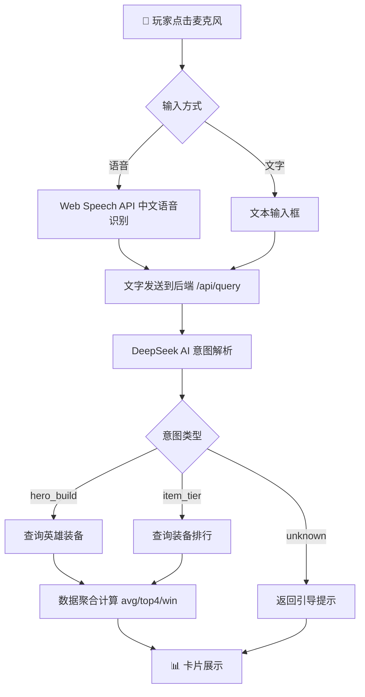
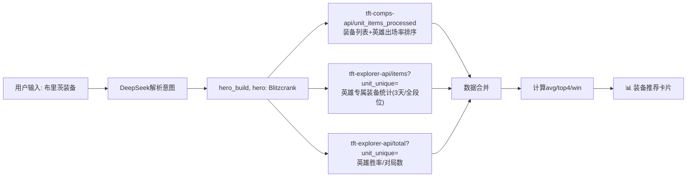
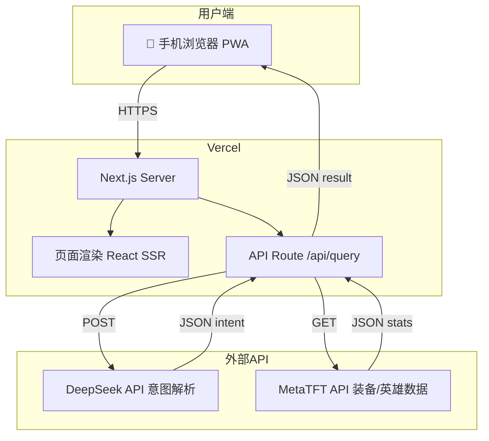

# TFT Voice Assistant — PRD v2.0

## 云顶之弈语音数据助手

| 字段 | 内容 |
|------|------|
| 版本 | v2.0 |
| 日期 | 2026-06-16 |
| 状态 | MVP 已上线 |
| 作者 | zeros-xiaohu |
| 仓库 | https://github.com/Zeros-xiaohu/tft-voice-assistant |
| 线上 | https://tft-voice-assistant.vercel.app |
| 平台 | Web（PWA），移动端优先 |

---

## 1. 产品背景

### 1.1 场景

云顶之弈排位赛中，准备阶段约 30 秒。玩家需要：查看对手 → 回忆数据 → 选择阵容 → 分配装备。

查询数据链路：切屏/拿手机 → 浏览器 → MetaTFT → 搜索 → 阅读 → 决策。耗时 15-25 秒。

### 1.2 解决方案

语音 AI + MetaTFT 数据聚合，压缩链路为：

**说话（2 秒）→ AI 解析意图（1 秒）→ 展示精简卡片（2 秒）= 总共 5 秒**

---

## 2. 产品概述

### 2.1 核心价值

> "你说，它查，你只需做决策。"

- 🎤 语音输入替代打字
- 🧠 DeepSeek AI 理解意图
- 📊 MetaTFT 数据聚合展示
- 📱 手机 PWA，无需切屏

### 2.2 核心流程图



### 2.3 数据获取流程（hero_build）



### 2.4 部署架构



---

## 3. 功能需求

### 3.1 MVP 功能（已实现）

| 功能 | 状态 | 说明 |
|------|------|------|
| 语音输入 | ✅ | Web Speech API，中文识别 |
| 文字输入 | ✅ | 输入框 + 快捷按钮降级 |
| 意图识别 | ✅ | DeepSeek Chat，JSON 格式解析 |
| 英雄配装查询 | ✅ | avg排名 + 前四率 + 胜率 + 选取次数 |
| 装备排行查询 | ✅ | Top 12 装备，按 avg 排序 |
| PWA 安装 | ✅ | 支持添加到手机主屏幕 |
| 移动端适配 | ✅ | iOS 风格设计 |

### 3.2 支持的意图

| 意图 | 示例 | 返回数据 |
|------|------|----------|
| `hero_build` | "剑圣装备"、"亚索带什么" | 5 件推荐装备 + avg/top4/win + 英雄统计 |
| `item_tier` | "装备排行"、"什么装备强" | Top 12 装备排行 |
| `unknown` | 无法理解 | 引导提示 + 快捷查询按钮 |

### 3.3 不做的（v2.0）

| 功能 | 原因 |
|------|------|
| 用户系统/登录 | MVP 不需要 |
| 语音播报 | 卡片已足够 |
| 历史记录 | 暂不持久化 |
| 阵容排行 (comp_tier) | P1 待做 |
| 英雄克制 / 装备合成 | P2 待做 |

---

## 4. 技术架构

### 4.1 技术栈

| 层 | 选型 | 理由 |
|----|------|------|
| 框架 | Next.js 14 (App Router) | API Routes 代理，Vercel 部署 |
| 语言 | TypeScript | 类型安全 |
| UI | Tailwind CSS | 快速构建移动端 UI |
| 语音 | Web Speech API | 浏览器原生，零依赖 |
| AI | DeepSeek Chat | 低成本低延迟，中文好 |
| 数据 | MetaTFT API | 云顶之弈权威数据 |
| 部署 | Vercel | 一键部署，免费额度 |

### 4.2 MetaTFT API 使用

| API | 用途 | 参数 |
|-----|------|------|
| `tft-comps-api/unit_items_processed` | 英雄装备列表 + 出场率排序 | - |
| `tft-explorer-api/items` | 英雄专属装备统计数据 | `unit_unique` + `days=3` |
| `tft-explorer-api/total` | 英雄总体胜率/对局数 | `unit_unique` + `days=3` |
| `tft-stat-api/items` | 全局装备排行 | - |

---

## 5. UI 设计

### 5.1 页面结构

```
┌─────────────────────────────────┐
│       云顶语音助手 (Header)        │
├─────────────────────────────────┤
│   📱 对话区域                    │
│   ┌─────────────────────────┐   │
│   │ 用户: 布里茨装备          │   │
│   │                         │   │
│   │ ┌─ 英雄概览 ─────────┐  │   │
│   │ │ 排名 4.05 | 胜率 18% │  │   │
│   │ │ 对局 193,438        │  │   │
│   │ └────────────────────┘  │   │
│   │                         │   │
│   │ 装备 | avg | top4 | win  │   │
│   │ 冰霜  | 3.84 | 61.9%   │   │
│   │ 石像  | 3.83 | 62.4%   │   │
│   └─────────────────────────┘   │
│                                 │
├─────────────────────────────────┤
│         🎤                      │
│     点击说话                     │
│   或者输入文字…                   │
└─────────────────────────────────┘
```

### 5.2 设计原则

- **信息密度高，扫描快**：图标 > 数字 > 文字，3 秒获取关键信息
- **单手操作友好**：大按钮，底部操作区
- **暗色主题**：护眼不干扰游戏
- **动画克制**：微交互有，不消耗时间

---

## 6. 成功指标

| 指标 | 目标 | 当前 |
|------|------|------|
| 语音识别准确率 | > 90% | 待测 |
| 意图识别准确率 | > 95% | 待测 |
| 响应时间（说话→卡片） | < 5s | ~3s |
| 数据准确度 | 与 MetaTFT 一致 | ✅ |
| PWA 安装可用 | ✅ | ✅ |
| Vercel 部署 | ✅ | ✅ |

---

## 7. 路线图

| 阶段 | 内容 | 状态 |
|------|------|------|
| Phase 1 | 语音 + 英雄配装 + 装备排行 + PWA | ✅ 已完成 |
| Phase 2 | 阵容排行 (comp_tier) | 🔜 待做 |
| Phase 3 | 英雄克制 + 装备合成 | 📋 计划中 |
| Phase 4 | 数据自动更新 + 多版本 | 📋 计划中 |

---

## 附录：名词对齐

| 用户说 | 系统理解 | 英文/游戏名 |
|--------|----------|-------------|
| 剑圣 | 易大师 | Master Yi |
| 瞎子 | 李青 | Lee Sin |
| 亚索 | 疾风剑豪 | Yasuo |
| 男枪 | 格雷福斯 | Graves |
| 努努 | 雪人骑士 | Nunu |
| 机器人 | 布里茨 | Blitzcrank |
| 羊刀 | 鬼索的狂暴之刃 | Guinsoo's Rageblade |
| 无尽 | 无尽之刃 | Infinity Edge |
| 吃鸡 | 第一名 | 1st Place |
